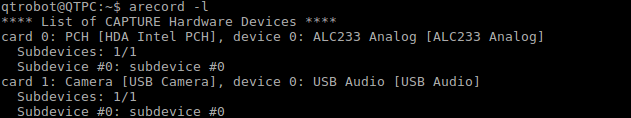
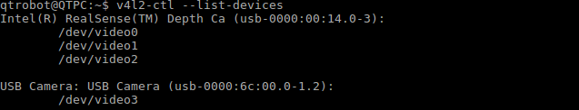

Deployment
==========

Setting up external devices
^^^^^^^^^^^^^^^^^^^^^^^^^^^
Connect all external devices to the USB-C adapter, then run the following commands to check that they're properly connected.

Microphone
**********
Open a terminal and do the following:

* Enter :code:`arecord -l` and check that 'USB Audio' appears under card1, device 0:

Webcam
******
Open a terminal and enter the following commands one at a time:

* :code:`sudo apt-get install v4l-utils`
* :code:`v4l2-ctl --list-devices`

Check what device number the USB Camera appears under. In the following example, the camera is device 3:

Running the interaction locally
^^^^^^^^^^^^^^^^^^^^^^^^^^^^^^^
To start the interaction locally, connect a monitor, keyboard, and mouse to the QT through a USB-C adapter. Open a new terminal
(the black rectangle icon on the left sidebar, see image below):

 .. image:: images/terminal_icon.png
    :width: 400
    :alt: Image of terminal application icon

Enter the following into the terminal to access the vision-project directory: :code:`cd ~/vision-project/docker`

Start the interaction: :code:`./run.sh run`

Through Dataplicity
^^^^^^^^^^^^^^^^^^^