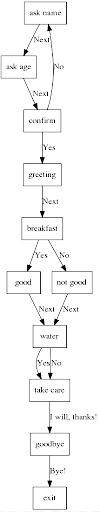

Setup
=====

There are two ways to setup this project. The easiest and cleanest is to use a Docker container. However, if you need the interaction to run upon bootup, you are probably better off setting up this project on your local machine (not in a Docker container). Below are instructions for both of these methods.

On Docker
^^^^^^^^^
To run a Docker container, go into the :code:`docker` directory in this project's repository and run the :code:`run` script. Note that you can pass in various arguments to the run script:
  * :code:`./run.sh run` will start the vision project's interaction
  * :code:`./run.sh terminal` will give you access to a terminal inside the Docker container. Note, if you want additional terminals you can :code:`docker exec` into the running container.
      * This is probably the best option if you are accessing QT remotely or using a non Linux operating system, as graphics won't work.
  * :code:`./run.sh popup` creates a new terminal window from which you can launch other programs, such as PyCharm or RViz.

.. note::
    If you have :code:`make` installed, you can test that your Docker image is setup correctly and that you have valid Amazon Web Services (AWS) credentials by running :code:`make test_docker`. Be aware that this script assumes that you have the following environmental variables set: :code:`AWS_SECRET_KEY_ID` and :code:`AWS_SECRET_KEY`. If you don't have these set, add the following lines to the end of your :code:`~/.bashrc` and then source your :code:`~/.bashrc`: :code:`source ~/.bashrc`.

    .. code-block:: bash

        export AWS_SECRET_KEY_ID="<my secret key id>"
        export AWS_SECRET_KEY="<my secret key>"

On your local machine
^^^^^^^^^^^^^^^^^^^^^

To run the interaction on your local machine, you'll need to install several packages. If you have :code:`make` installed (:code:`sudo apt update; sudo apt install -y make`, on Ubuntu 16.04), you install the necessary dependencies with :code:`make install_deps`. If you don't have :code:`make` installed, you can also access the script with :code:`./docker/scripts/install_deps.sh`.

Once you have the dependencies installed, you'll need to clone several repositories into the :code:`src` folder in your catkin workspace

.. code-block:: bash

    git clone https://github.com/robotpt/vision-project.git
    git clone https://github.com/robotpt/cordial.git
    git clone https://github.com/robotpt/qt-robot.git
    git clone https://github.com/robotpt/ros-data-capture.git
    git clone https://github.com/RobotWebTools/rosbridge_suite.git

Finally, you will have to build your catkin workspace with :code:`catkin_make` from the top folder of your catkin workspace. Note, make sure that you have your ROS environment sourced. After you make your workspace, you can run the tests to confirm that your environment is setup. Make sure you have run :code:`aws configure` or setup your AWS configuration and credentials files manually.

.. code-block:: bash

    source /root/catkin_ws/devel/setup.bash && rostest cordial_gui test_cordial_gui_actions.test && rostest cordial_gui test_cordial_gui_pubs_and_subs.test && rostest cordial_manager test_cordial_manager_actions.test && rostest cordial_manager test_cordial_manager_pubs_and_subs.test && rostest cordial_manager test_cordial_manager_services.test

Visualizing the interaction
^^^^^^^^^^^^^^^^^^^^^^^^^^^

The content of the interaction is contained in a :code:`StateCollection` object. Use :code:`StateCollection.visualize()` to view a flowchart of the interaction. By default, the flowchart displays only the name of each node; set the :code:`show_content` parameter to :code:`True` to display the entire message.

Here is an example:

